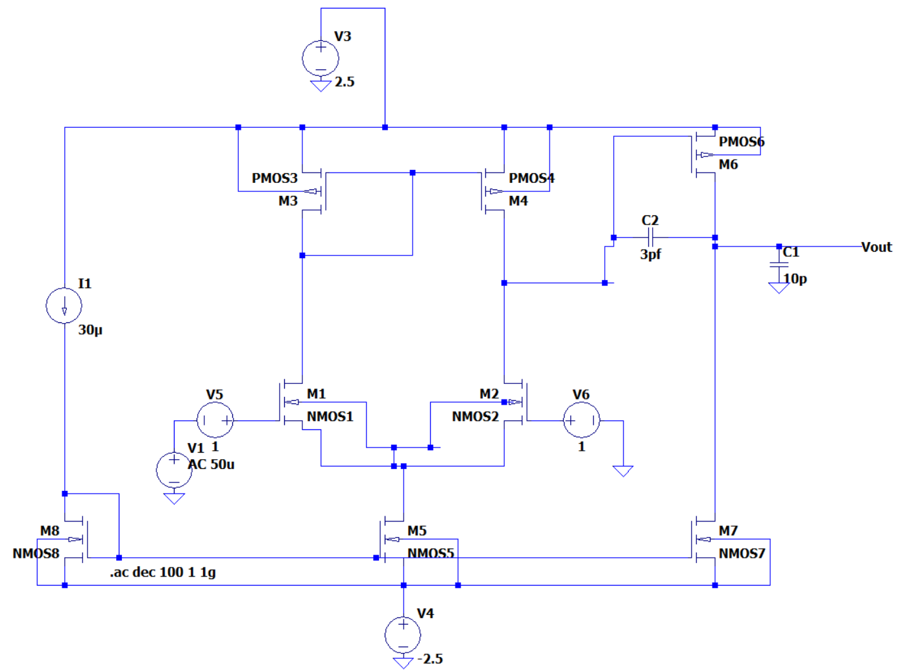
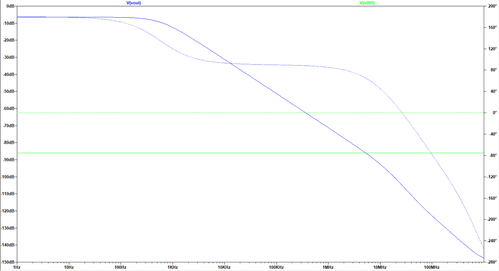

# Two-Stage CMOS 1 µm Operational Amplifier Design with Miller Compensation

## 1. Overview
This project focuses on the design and analysis of a two-stage operational amplifier in CMOS 1 µm technology, implementing load/Miller capacitor compensation for stability. The design achieves a high open-loop gain, wide gain–bandwidth product, and stable phase margin suitable for analog signal processing applications.

**Key Specifications:**
- **Technology:** CMOS 1 µm
- **Architecture:** Two-stage op-amp
- **Compensation:** Load/Miller capacitor
- **Open-loop gain:** 78 dB
- **GBW:** 5 MHz
- **Phase margin:** 60°

---

## 2. Objectives
- Design a stable high-gain op-amp using CMOS 1 µm process parameters.
- Perform hand calculations for W/L ratio selection.
- Achieve the target performance metrics for gain, GBW, and phase margin.

---

## 3. Design Methodology
1. **Technology Selection**
   - CMOS 1 µm process for robust analog performance and easier hand analysis.
2. **Circuit Topology**
   - Two-stage op-amp structure (differential input stage + gain stage).
3. **Compensation Technique**
   - Load/Miller capacitor for improved stability.
4. **Hand Analysis**
   - Determined transistor sizes (W/L) based on required gain and bias currents.
5. **Simulation**
   - Verified performance using SPICE-based simulation.

---

## 4. Hand Calculation Summary
- Derived DC gain from transistor parameters.
- Estimated GBW from unity-gain frequency formula.
- Ensured phase margin > 60° via pole-zero placement.

---

## 5. Results
| Parameter        | Target   | Achieved |
|------------------|----------|----------|
| Open-loop Gain   | ≥ 75 dB  | 78 dB    |
| GBW              | ≥ 5 MHz  | 5 MHz    |
| Phase Margin     | ≥ 60°    | 60°      |

---

## 6. Schematic

--- 
#### Netlists

.model NMOS1 NMOS (LEVEL=1 KP=330u LAMBDA=0.04 VTO=0.7  CGSO=1.76e-10 CGDO=1.76e-10) 

.model NMOS2 NMOS (LEVEL=1 KP=330u LAMBDA=0.04 VTO=0.7  CGSO=1.76e-10 CGDO=1.76e-10)

.model PMOS3 PMOS (LEVEL=1 KP=750u  LAMBDA=0.05 VTO=-0.7 CGSO=1.60e-10 CGDO=1.60e-10)

.model PMOS4 PMOS (LEVEL=1 KP=750u  LAMBDA=0.05 VTO=-0.7 CGSO=1.60e-10 CGDO=1.60e-10)

.model NMOS5 NMOS (LEVEL=1 KP=495u LAMBDA=0.04 VTO=0.7  CGSO=3.52e-10 CGDO=3.52e-10)

.model PMOS6 PMOS (LEVEL=1 KP=4700u  LAMBDA=0.05 VTO=-0.7 CGSO=1.60e-10 CGDO=1.60e-10)

.model NMOS7 NMOS (LEVEL=1 KP=1540u LAMBDA=0.04 VTO=0.7  CGSO=3.52e-10 CGDO=3.52e-10)

.model NMOS8 NMOS (LEVEL=1 KP=495u LAMBDA=0.04 VTO=0.7  CGSO=3.52e-10 CGDO=3.52e-10)

---

## 7. Simulation Results

  

---

## 8. Conclusion
The designed two-stage CMOS 1 µm op-amp meets the desired performance metrics with adequate stability for analog applications. The use of Miller compensation proved effective in achieving the target phase margin without sacrificing bandwidth.

---

## 9. References
- Sedra, A.S., Smith, K.C., *Microelectronic Circuits*.
- A. Sadeqi, J. Rahmani, S. Habibifar, Design Method for Two-Stage CMOS Operational Amplifier Applying 
Load/Miller Capacitor Compensation, Computational Research Progress in Applied Science & Engineering, CRPASE: Transactions of 
Electrical, Electronic and Computer Engineering 6 (2020) 153–162.

---

